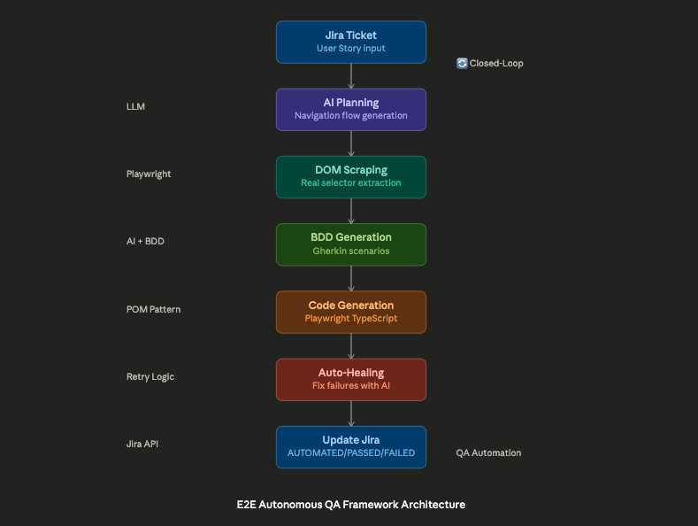

# E2E Autonomous QA Framework

> AI-powered end-to-end testing framework that automates the entire QA lifecycle: from Jira User Story → BDD scenarios → Playwright tests → Execution → Results back to Jira.

## 🌟 Key Features

- **Closed-Loop Automation**: Reads Jira tickets, generates tests, executes them, and updates Jira with results
- **AI-Powered Test Generation**: Uses LLM to generate BDD scenarios and Playwright code
- **Auto-Healing**: Automatically fixes failing tests using AI (up to 5 retry attempts)
- **Smart DOM Scraping**: Extracts semantic selectors from real application DOM
- **Jira Integration**: Full integration with Atlassian Jira API (ADF parsing, ticket creation, linking)
- **Page Object Model**: Generates clean, maintainable TypeScript code following POM pattern

## 🏗️ Architecture



## 📦 Installation
```bash
git clone https://github.com/diegroma/autonomous-qa-framework.git
cd autonomous-qa-framework
npm install
```

## ⚙️ Configuration

Create `.env` file:
```env
# LLM API (Groq)
GROQ_API_KEY=your_groq_api_key_here

# Jira API
JIRA_DOMAIN=https://your-company.atlassian.net
JIRA_EMAIL=your-email@company.com
JIRA_API_TOKEN=your_jira_api_token
JIRA_PROJECT=DEV

# Target Application
TARGET_URL=https://your-app.com

# Optional
FALLBACK_TIMEOUT=3000
GROQ_MODEL=llama-3.3-70b-versatile
GROQ_TEMPERATURE=0.1
GROQ_MAX_TOKENS=4096
TEST_TIMEOUT=60000
AUTH_USERNAME=your_url_username
AUTH_PASSWORD=your_url_password
```

## 🚀 Usage
```bash
npm run generate-jira
```

Interactive flow:
1. Select Jira ticket (manual ID or from list)
2. AI plans navigation
3. Scraper extracts DOM
4. AI generates BDD scenarios
5. Approve scenarios to save
6. Select scenarios to automate
7. AI generates Playwright code
8. Auto-healer runs tests (up to 5 attempts)
9. Results updated in Jira

## 🧪 Example Output
```
✅ Loaded from Jira: [DEV-123] User login feature
Planning navigation...
   Path: LoginPage(goto) -> LoginPage(fill) -> DashboardPage(click)
   POMs to create: LoginPage, DashboardPage

🕵️‍♂️ Validating navigation flow...
   -> [LoginPage] Executing: goto https://app.com
      ✓ Captured 45 locators
   
Generating test scenarios (BDD)...
APPROVE scenarios to save:
 ◉ Successful login with valid credentials
 ◉ Login fails with invalid password
 ◯ Login fails with empty email

☁️  Uploading tests to Jira...
   🔗 Created: DEV-124 -> Successful login (MANUAL)

Generating Playwright code...
Running tests — attempt 1/5...
✅ All tests passed!

🏷️  Updating Jira tickets...
   ✅ Updated DEV-124 -> AUTOMATED, PASSED
```

## 📁 Project Structure
```
├── agents/
│   └── qualia.agent.md        # AI system prompt (BDD & Playwright rules)
├── src/
│   ├── ai/
│   │   ├── groqClient.ts      # LLM API client with retry
│   │   └── prompts.ts         # Prompt engineering
│   ├── healer/
│   │   └── autoHealer.ts      # Auto-healing engine
│   ├── scraper/
│   │   └── playwrightDom.ts   # Smart DOM extraction
│   ├── utils/
│   │   ├── jiraClient.ts      # Jira API integration
│   │   ├── fileSystem.ts      # File management
│   │   └── clean.ts           # Utility to clear generated files
│   ├── e2e-jira-generator.ts  # Main orchestrator
│   └── types.ts               # TypeScript interfaces and global constants
├── features/                  # Generated .feature files
├── pages/                     # Generated Page Objects
├── tests/                     # Generated .spec.ts files
└── .env                       # Configuration (not committed)
```

## 🎯 Tech Stack

- **Runtime**: Node.js + TypeScript
- **Testing**: Playwright
- **LLM**: Groq API (Llama 3.3 70B)
- **BDD**: Gherkin
- **Issue Tracking**: Atlassian Jira API v3
- **Pattern**: Page Object Model (POM)

## ⚡ Key Differentiators

### 1. Closed-Loop QA
Unlike traditional automation frameworks, this maintains a **bidirectional sync** with Jira:
- Tests are created FROM requirements
- Results are pushed BACK to requirements
- Single source of truth in Jira

### 2. Auto-Healing with AI
Failed tests are automatically diagnosed and fixed:
- Extracts error from Playwright output
- Sends error + current code + DOM to LLM
- Rewrites code with fixes
- Re-runs (up to 5 attempts)

### 3. No Selector Hallucinations
AI is constrained to ONLY use selectors from real DOM:
- Scraper extracts actual `[data-test]`, buttons, inputs
- AI cannot invent selectors
- Fallback chains for resilience

## 🐛 Known Limitations

- Requires Groq API key (free tier available)
- Only supports Playwright (not Selenium/Cypress)
- Auto-healing success rate ~70-80% (depends on error type)
- DOM scraping fails if navigation times out

## 🤝 Contributing

Contributions welcome! 

## 📄 License

MIT

## 👤 Author

**Diego Rodriguez**
- Senior QA Engineer with 10+ years experience
- Specialized in AI-driven test automation
- [LinkedIn] www.linkedin.com/in/diegorodmad

## 🙏 Acknowledgments

- Inspired by Closed-Loop QA principles
- Built with modern Playwright best practices
- Prompt engineering techniques from OpenAI/Anthropic research

---

⭐ If this project helped you, please star the repo!
